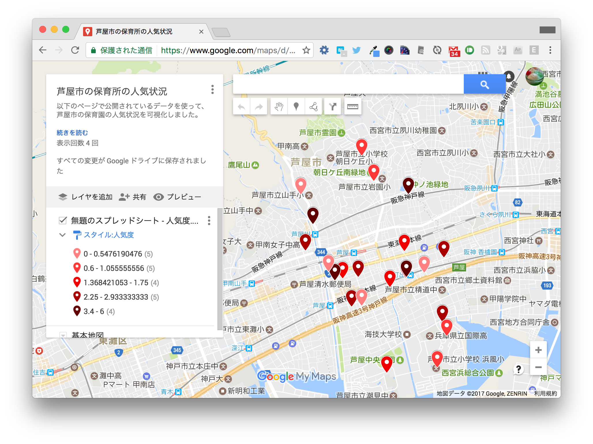
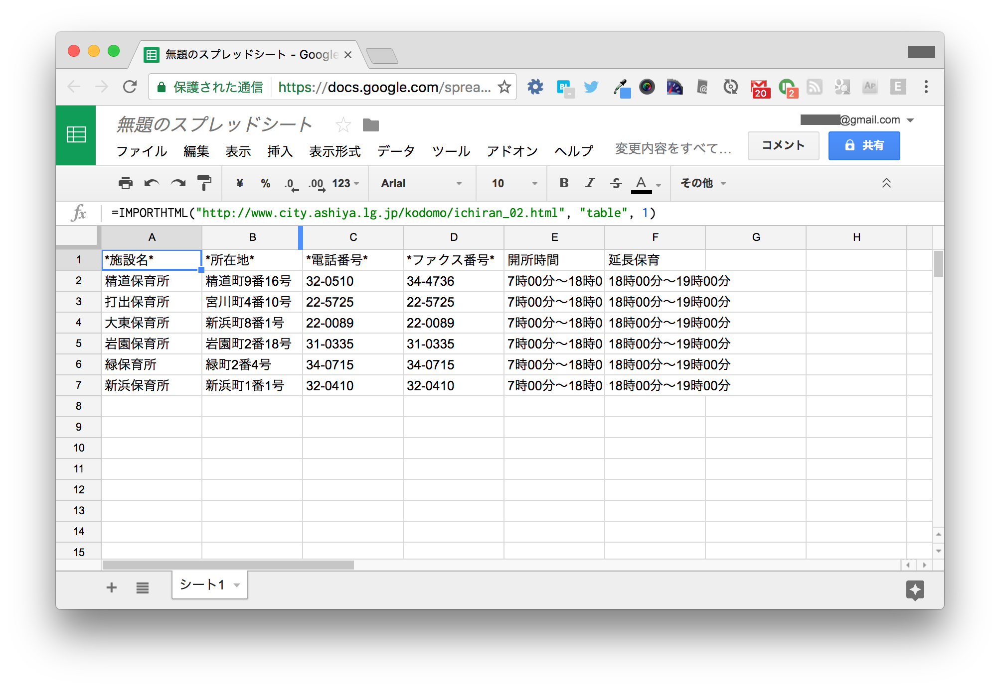
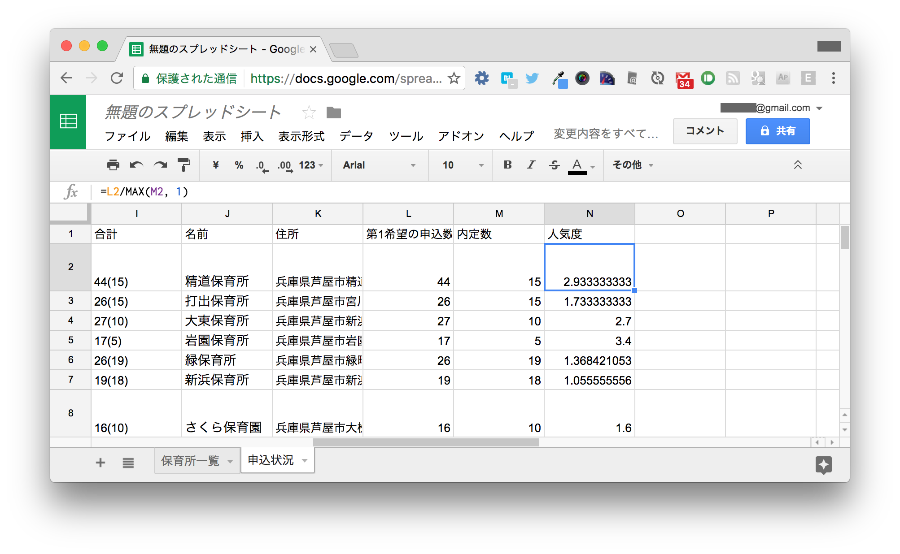
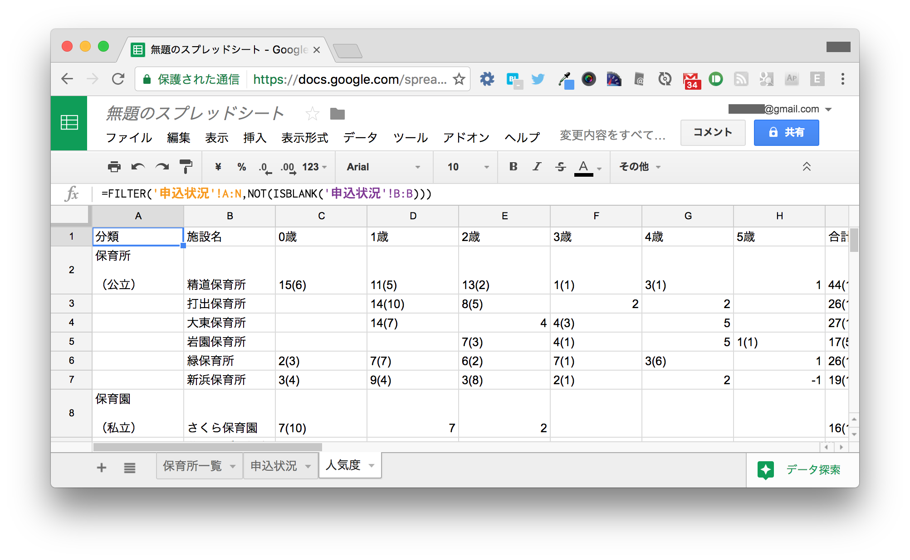
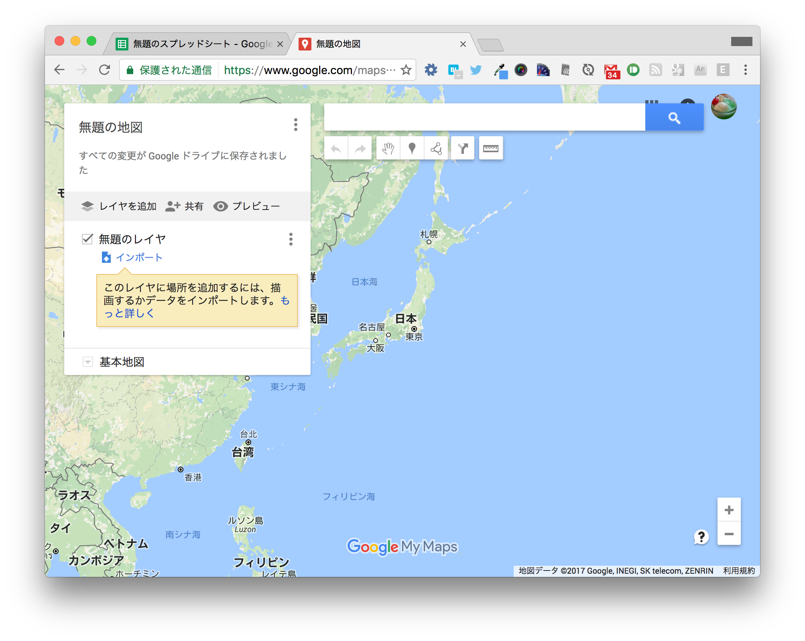
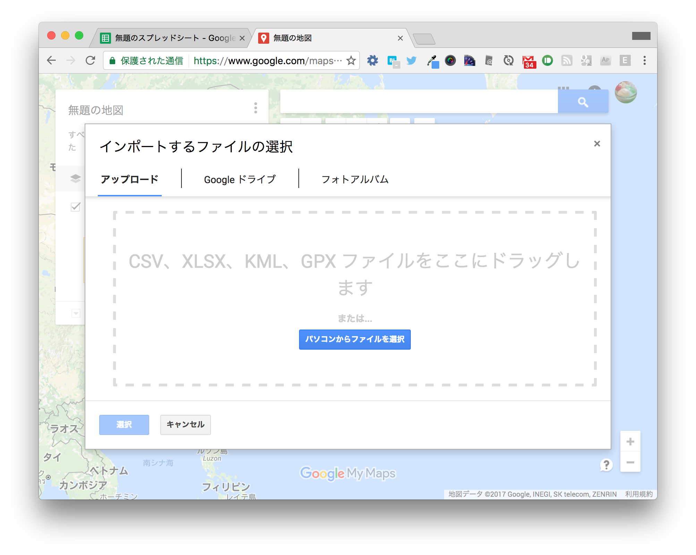
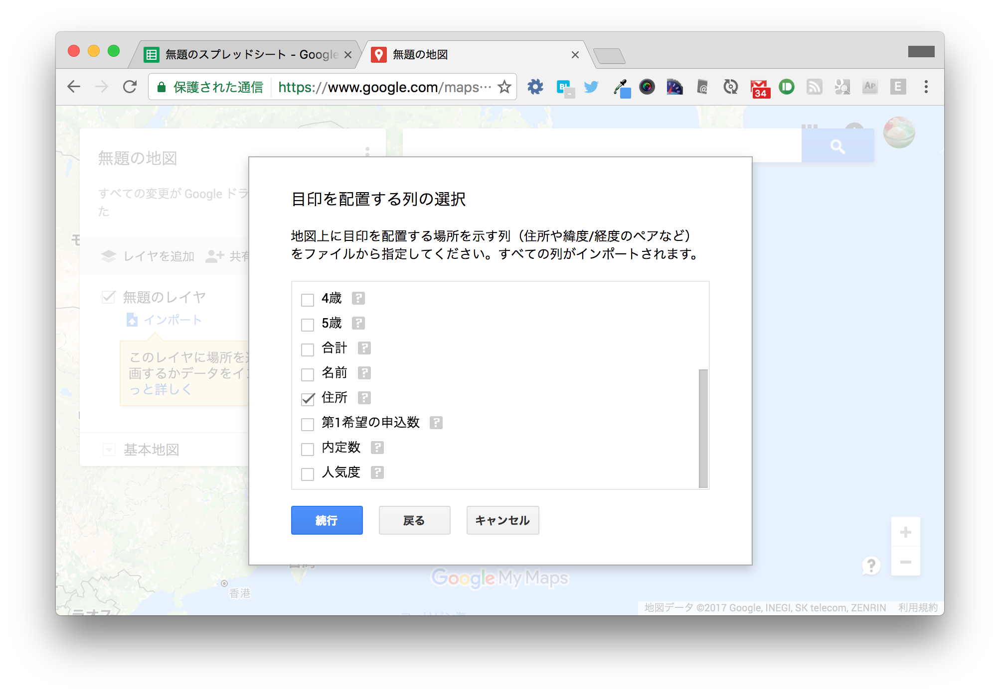
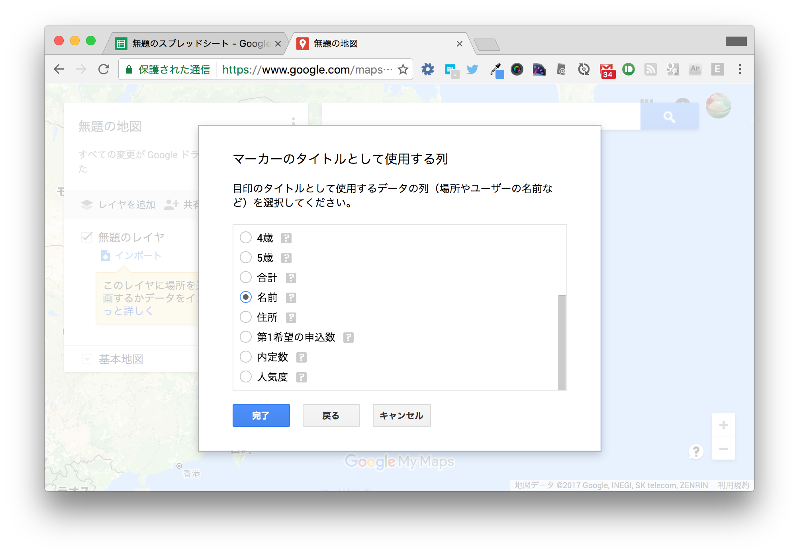
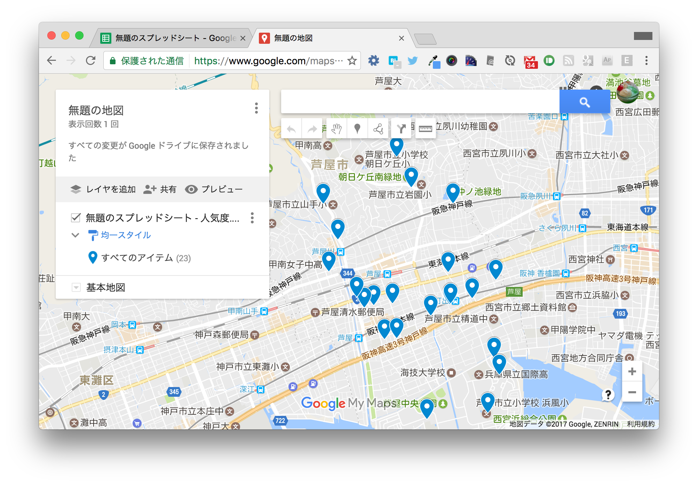
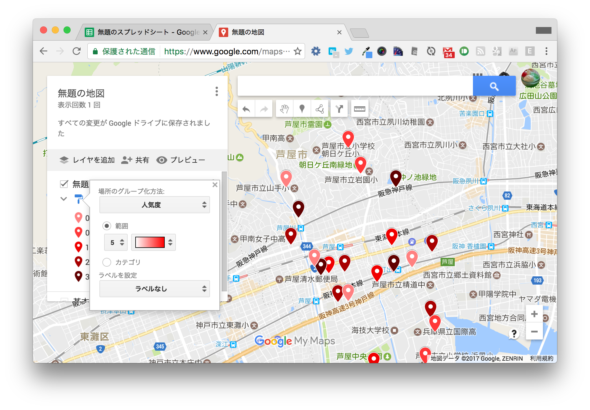

===================================
ハンズオン1. 保育園の人気状況可視化
===================================

このハンズオンでは、Googleスプレッドシートを使って芦屋市の保育園の人気状況を可視化します。

完成イメージ
============

完成イメージは以下のとおりです。人気度の高い保育所ほどマーカーの色が濃くなっています。

https://drive.google.com/open?id=1qZh6NnbMyC_f9lIgBL5jgcZ0150&usp=sharing

元になるデータ
==============

完成イメージのように可視化するためには、保育所ごとに名前・住所・人気度の値が必要です。
以下の2つのページから収集したデータを結合して、地図上に可視化します。

* `芦屋市／芦屋市内の保育施設・定員一覧 <http://www.city.ashiya.lg.jp/kodomo/ichiran_02.html>`_
* `芦屋市／保育所等の申し込み状況 <http://www.city.ashiya.lg.jp/kodomo/moushikomijyoukyou2704.html>`_

1. 保育所一覧を取得する
=======================

まず `保育所の一覧 <http://www.city.ashiya.lg.jp/kodomo/ichiran_02.html>`_ を取得します。

1-1. Webページから表を取得する
------------------------------

Googleスプレッドシートでは、 ``IMPORTHTML()`` 関数でWebページの表をスプレッドシートに取り込めます。

新しく作成したスプレッドシートの ``A1`` セルに以下のように入力します。 ::

    =IMPORTHTML("http://www.city.ashiya.lg.jp/kodomo/ichiran_02.html", "table", 1)

``IMPORTHTML()`` 関数に指定する引数は次の意味を表します。 ::

    =IMPORTHTML(<WebページのURL>, <"table" (表) または"list" (リスト)>, <ページ内での登場順序>)

* `IMPORTHTML - ドキュメント エディタ ヘルプ <https://support.google.com/docs/answer/3093339>`_

``IMPORTHTML()`` 関数は配列を返します。Googleスプレッドシートで配列を返す関数を使うと、式を入力したセル以外にも値が表示されます。

2番目の表を取得したい場合は、以下のようにします。 ::

    =IMPORTHTML("http://www.city.ashiya.lg.jp/kodomo/ichiran_02.html", "table", 2)

.. note::

    この程度であればHTMLの表をコピーして貼り付けても同じだと思われるかもしれません。
    コピー&ペーストとIMPORTHTML()関数の大きな違いは、更新への対応です。
    IMPORTHTML()関数を使うと、Webページが更新された時に人間が作業をすることなく最新の情報を取得できます。

1-2. 複数の表を取得して結合する
-------------------------------

このページでは保育所の情報がカテゴリ（市立・私立・認定こども園・小規模保育事業所）ごとに4つの表に分かれています。
市立保育所だけでなく、全カテゴリの保育所を取得したいです。

空いているA8セルに2番目の表を取り込むのも一つの案ですが、そうすると保育所の数が変化した時に困ります。
例えば、市立保育所の数が6→7に増えた場合、空白行が足りないので、市立保育所の取得結果が展開されなくなります。

複数の配列を縦に結合するには、 ``={ 配列1; 配列2; 配列3; 配列4 }`` という表記を使います。
``A1`` セルに以下のように入力します（読みやすくするために改行していますが、入力の際はなくても構いません）。 ::

    ={IMPORTHTML("http://www.city.ashiya.lg.jp/kodomo/ichiran_02.html", "table", 1);
      IMPORTHTML("http://www.city.ashiya.lg.jp/kodomo/ichiran_02.html", "table", 2);
      IMPORTHTML("http://www.city.ashiya.lg.jp/kodomo/ichiran_02.html", "table", 3);
      IMPORTHTML("http://www.city.ashiya.lg.jp/kodomo/ichiran_02.html", "table", 4)}

4つの表が結合された状態で表示されます。

1-3. 取得した表のデータを整える
-------------------------------

このデータは後で他のシートから参照したいので、シート名を ``保育所一覧`` に変更しておきます。

また、データを見ると若干扱いづらい点があります。

1. 施設名に※がついているものがある
2. 所在地が町名から始まるローカルな住所である

これを直します。A列の左側に2列挿入し、以下のように入力します。

=== ============================ =========================
..  A                            B
=== ============================ =========================
1   名前                         住所
2    ``=SUBSTITUTE(C2,"※","")``  ``="兵庫県芦屋市" & D2``
=== ============================ =========================

SUBSTITUTE()関数は第1引数の文字列から第2引数の文字列を探し、それをすべて第3引数に置き換えた文字列を得ます。 ``"※"`` を ``""`` （空文字）に置き換えることで、不要な※を削除します。 ::

    =SUBSTITUTE(<対象の文字列>, <探す文字列>, <置き換える文字列>)

* `SUBSTITUTE - ドキュメント エディタ ヘルプ <https://support.google.com/docs/answer/3094215>`_

演算子の ``&`` は左右の文字列を結合します。先頭に兵庫県芦屋市をつけることで、Googleマップでも正しく認識される住所にします。

入力できたらA2:B2セルを選択し、表の一番下の行までオートフィル（選択範囲の右下のハンドルをドラッグ）します。
※がついていた施設名から※が取り除かれていることがわかります。

.. image:: images/nursery/step1-3.png

.. note::

    8行目など、表のヘッダーだった行の住所は変な値になりますが、気にしなくて大丈夫です。

2. 保育所の申込状況を取得する
==============================

続いて、 `保育所の申込状況 <http://www.city.ashiya.lg.jp/kodomo/moushikomijyoukyou2704.html>`_ を取得します。

2-1. データ内容の確認
---------------------

まずWebページでデータを見てみましょう。

.. image:: images/nursery/step2-1.png

この表には施設ごとに第1希望の申込数と内定数が掲載されています。
カッコに囲われてない数字が第1希望の申込数で、カッコで囲われた数が内定数です。
人気状況を可視化するにあたって、一番右の合計の列を見ることにします。

``第1希望の申込数 > 内定数`` の保育所は入所しづらく、 ``第1希望の申込数 < 内定数`` の保育所は入所しやすいと言えるでしょう。

.. note::

    カッコ書きの数字がない保育所は、内定者が0、つまりまったく空きがないということになります。
    誰も第1希望としなかったものの、内定者がいる保育所はカッコ書きの数字のみが記載されています。

2-2. 申込状況の取得
--------------------

では確認したデータを取得します。
新しくシートを作成し、 ``申込状況`` という名前をつけます。

A1セルに以下のように入力します。 ::

    =IMPORTHTML("http://www.city.ashiya.lg.jp/kodomo/moushikomijyoukyou2704.html", "table", 1)

取得結果を見ると、 ``(1)`` と書かれていたセルが ``-1`` と認識されているなど、意図しない変換がなされています。
残念ながらIMPORTHTML()関数でこれを回避する方法はありません。
この程度であれば許容範囲なので、このまま進めます。

2-3. 第1希望の申込数と内定数を分離する
--------------------------------------

合計の列（I列）のデータは2つの意味を持つデータが同じセルに含まれていて扱いづらいので、これを分離します。

とりあえず文字列として見て ``(`` で分割すれば良さそうです。
文字列の分割にはSPLIT()関数を使います。

後で使うために2列空けて、L列とM列に次のように入力します。K2セルは入力不要です。

=== ============================ =========================
..  L                            M
=== ============================ =========================
1   第1希望の申込数              内定数
2    ``=SPLIT(I2,"(")``
=== ============================ =========================

SPLIT()関数は第1引数のテキストを第2引数に含まれる区切り文字で分割します。 ::

    =SPLIT(<テキスト>, <区切り文字列>)

* `SPLIT - ドキュメント エディタ ヘルプ <https://support.google.com/docs/answer/3094136?hl=ja>`_

申込数の方はいい感じになりましたが、内定数には余計な括弧がついたままです。

区切り文字に ``)`` も追加してみましょう。L2セルを以下のように変更します。 ::

    =SPLIT(I2,"()")

内定数もいい感じになりました。

L2セルをL25までオートフィルします。
ほとんどの行はうまく分割できていますが、カッコ書きがなかったL19とカッコ書きのみのL21は若干異なります。

19行目は、M19が空でも0とみなせば特に問題ないでしょう。

21行目のようにカッコ書きの数字がマイナスに変換されてしまっているセルへの対処を考えます。
本来であれば、以下のようになって欲しいのです。

====== ====== =====
..     L      M
====== ====== =====
19     6      ..
20     1      8
**21** **0**  **4**
22     4      4
====== ====== =====

IF()関数を使うと、場合分けができます。数字がマイナスの場合は違う処理をしてみましょう。
IF()関数の使い方は次のとおりです。 ::

    =IF(<条件式>, <条件式が真の場合の値>, <条件式が偽の場合の値>)

L21セルに次のように入力します。 ::

    =IF(I21 < 0, {0, -I21}, SPLIT(I21,"()"))

これは、I21の値が0未満の場合は ``{0, -I21}`` という配列を返し、0以上の場合は先ほどのSPLIT()関数で分割した値を返すという意味です。
これによって、意図したとおりに値が反映されました。

21行目だけ異なる処理を書くのはスマートではないので、L2セルを以下のように変更して、もう一度下までオートフィルします。 ::

    =IF(I2 < 0, {0, -I2}, SPLIT(I2,"()"))

2-4. 保育所の住所を表示する
---------------------------

さて、最初に取得した保育所一覧シートと突き合わせて、申込状況シートに保育所の住所を表示してみましょう。

データの突き合わせにはVLOOKUP()関数が便利です。
VLOOKUP()関数はあるデータにマッチする行の別の列の値を取得する関数です。

* `VLOOKUP - ドキュメント エディタ ヘルプ <https://support.google.com/docs/answer/3093318>`_

空けておいたK列に以下のように入力します。

=== =====================================================
..  K
=== =====================================================
1   住所
2    ``=VLOOKUP(B2,'保育所一覧'!A:B,2,FALSE)``
=== =====================================================

K2セルの式は、B2セルの値（精道保育所）を保育所一覧シートのA列から探し、見つかった行の2列目、すなわちB列の値を取得するという意味です。

これによって、保育所名から住所を取得できます。

K2セルを24行目までオートフィルします。
大体取得できていますが、 ``#N/A`` というエラーになっている行もあります。

18行目の浜風あすの保育園は、なぜか保育所一覧には含まれていません。
取得元のWebページを見てもありません。
データ分析においては、このような例外データはつきものです。
今回は単に無視することにします。

19行目の愛光幼稚園は、保育所一覧にはありますが、B19セルの名称に ``(保育所部）`` が含まれているので正しく取得できていません。

このため、SUBSTITUTE()関数で取り除きます。SUBSTITUTE()関数の使い方は次のとおりです。 ::

    =SUBSTITUTE(<検索対象のテキスト>, <検索文字列>, <置換文字列>, [<出現回数>])

* `SUBSTITUTE - ドキュメント エディタ ヘルプ <https://support.google.com/docs/answer/3094215>`_

空けておいたJ列に以下のように入力し、K2セルもVLOOKUPで検索するデータをB2からJ2に変更します。

=== ======================================= =====================================================
..  J                                       K
=== ======================================= =====================================================
1   名前                                    住所
2    ``=SUBSTITUTE(B2,"(保育所部）","")``    ``=VLOOKUP(J2,'保育所一覧'!A:B,2,FALSE)``
=== ======================================= =====================================================

J2とK2を選択して下までオートフィルすると、先ほどは住所を取得できていなかった愛光幼稚園の住所が正しく取得できます。

.. image:: images/nursery/step2-11.png

2-5. 人気度を計算する
---------------------

人気度の定義として適切なものがなく、人気度という言葉が適切なのかもよくわかりませんが、ここでは次の式を人気度として使います。 ::

    第1希望の申込数 / 内定数

第1希望の申込数 > 内定数 すなわち、第1希望で内定できなかった人がいる保育所は1.0より大きい値になり、全員が内定した保育所は1.0以下の値となります。

ただし、内定数が0の保育所では0による除算でエラーになってしまうので、内定数が0の場合は1として計算するものとします。

右端のN1セルとN2セルに次のように入力します。

=== =====================
..  N
=== =====================
1   人気度
2    ``=L2/MAX(M2, 1)``
=== =====================

MAX()関数は引数の中から最大の値を取得する関数です。内定数が0の場合は1として扱うために使っています。

* `MAX - ドキュメント エディタ ヘルプ <https://support.google.com/docs/answer/3094013?hl=ja>`_

N2セルを一番下までオートフィルすると次のようになります。

3. 地図上に可視化する
=====================

最後にここまでで得られたデータを地図上に可視化します。

Googleマップのマイマップという機能を使います。マイマップはGoogleスプレッドシートやCSVファイルなどに保存された位置情報を可視化できます。

3-1. マイマップで可視化するためのデータ整形
-------------------------------------------

ここまでのデータでも地図上に保育所をプロットすることはできますが、余計な行があると人気度に応じた段階的なマーカーの色付けができません。
余計な行とは、25行目以降の合計などの行です。

手動で消すのも一つの方法ですが、データが変更される度に消すのは面倒です。
そこで、新しいシートを作成し、そこに必要な行だけを取り込みます。

FILTER()関数を使うと、指定した条件にマッチする行だけを抜き出せます。

新しく ``人気度`` というシートを作成し、そのA1セルに次のように入力します。 ::

    =FILTER('申込状況'!A:N,NOT(ISBLANK('申込状況'!B:B)))

これは、申込状況シートのA列からN列のデータを取り込み、その際にB列（施設名）が空でないデータだけを抜き出すという意味です。
先ほど余計と言った行には、B列にデータが含まれないことを利用します。

* `FILTER - ドキュメント エディタ ヘルプ <https://support.google.com/docs/answer/3093197?hl=ja>`_
* `NOT - ドキュメント エディタ ヘルプ <https://support.google.com/docs/answer/3093305?hl=ja>`_
* `ISBLANK - ドキュメント エディタ ヘルプ <https://support.google.com/docs/answer/3093290?hl=ja>`_

3-2. CSVファイルのダウンロード
------------------------------

マイマップはGoogleスプレッドシートからの取り込みができますが、残念ながら1つのシートのデータしか取り込めず、別のシートを参照しているデータは取り込めません。

人気度のシートのデータをすべてコピーして、新しいシートに値を貼り付けるのも1つの手ですが、ここでは1回CSVファイルとしてダウンロードし、それを可視化します。

人気度のシートを表示した状態で、メニューの「ファイル」→「形式を指定してダウンロード」→「カンマ区切りの値（.csv、現在のシート）」と辿ると、「無題のスプレッドシート - 人気度.csv」というファイルがダウンロードされます。

.. note::

    ダウンロードしたCSVファイルをMicrosoft Excelで開くと文字化けすることがありますが、気にしなくて大丈夫です。

3-3. マイマップへの取り込み
---------------------------

以下のページを開き、「新しい地図を作成」をクリックします。

`マイマップ <https://www.google.com/maps/d/>`_

次のような画面が表示されるので、吹出しの出ている「インポート」をクリックします。

ファイル選択画面が表示されるので、先ほどダウンロードしたCSVファイルを選択してアップロードします。

「目印を配置する列の選択」というダイアログが表示されるので、下の方から「住所」を選択して続行します。

「マーカーのタイトルとして使用する列」というダイアログが表示されるので、下の方から「名前」を選択して完了をクリックします。

地図上にマーカーが表示されます。日本全体が表示されたままではわかりづらいので、拡大しておきます。

3-4. マーカースタイルの設定
---------------------------

マーカーが全部青色で表示されています。
このままではあまり面白くないので、人気度に応じて色分けをしてみましょう。

地図の左上の枠内にある「均一スタイル」と書かれた箇所をクリックします。

「場所のグループ化方法」でデータ列別のスタイルから「人気度」を選択します。
「範囲」を選択し、数字は「5」を、色は赤いグラデーションを選択します。
この数字は5段階の色でグループ化するという意味です。

こうしてスタイルを設定することで、人気のある保育所がわかりやすくなりました。

4. まとめ
=========

このハンズオンは以上です。

このハンズオンでは、GoogleスプレッドシートのIMPORTHTML()関数を使って、2つのWebページの表に含まれるデータを取得しました。
1つのページからは保育所の住所を、もう1つのページからは保育所の人気状況を取得し、それらをVLOOKUP()関数を使って結合しました。
結合するにあたっては、細かいところで例外的なデータへの対応が必要でした。

最終的にGoogleマップのマイマップ機能を使って地図上に可視化しました。
マイマップ機能を使うと、位置情報を持つデータをわかりやすくできることを学びました。
