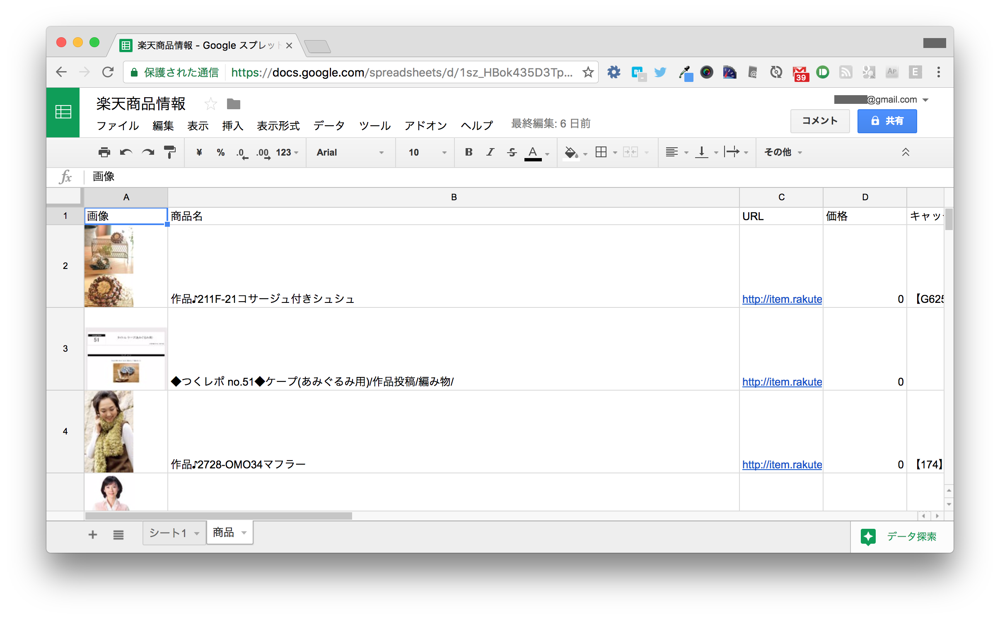
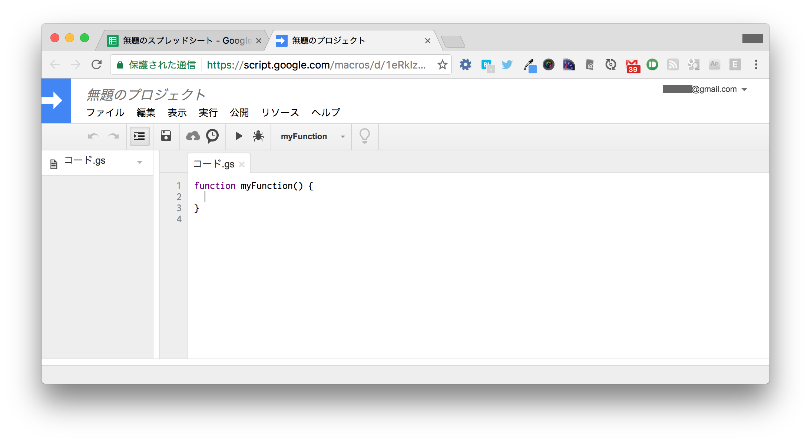
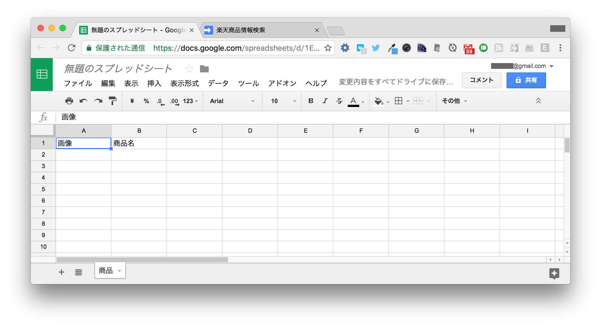
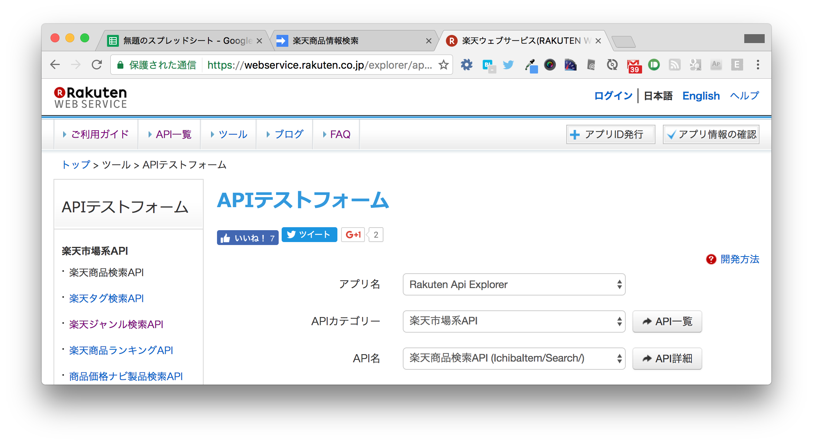
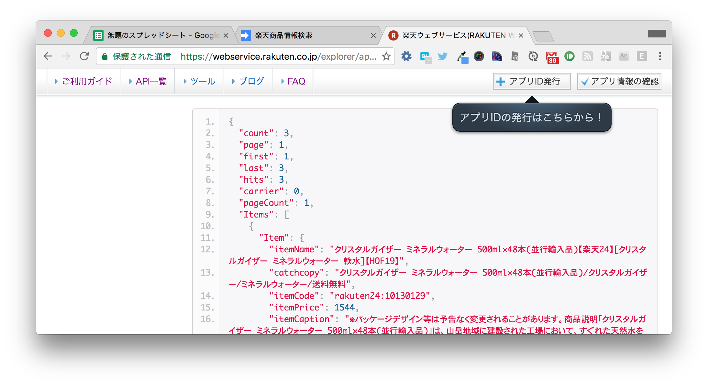
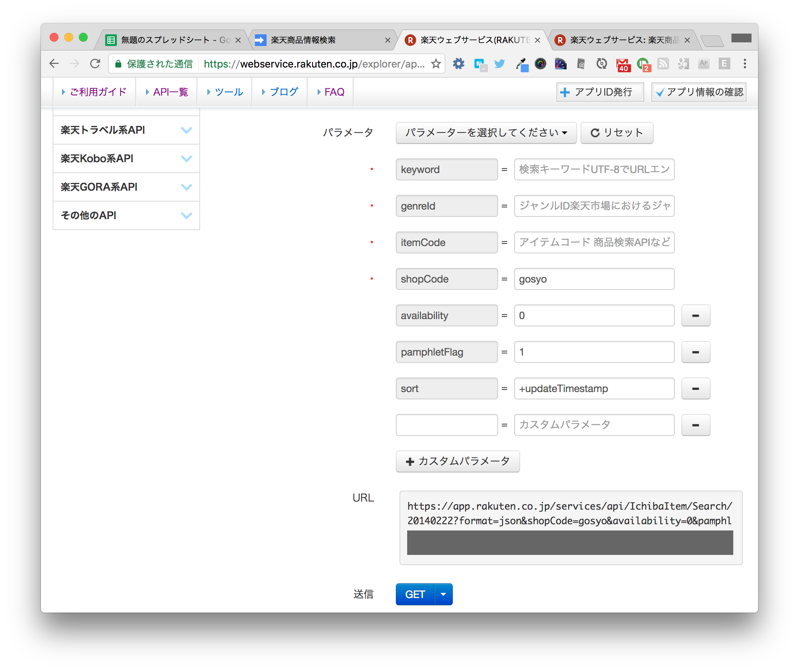
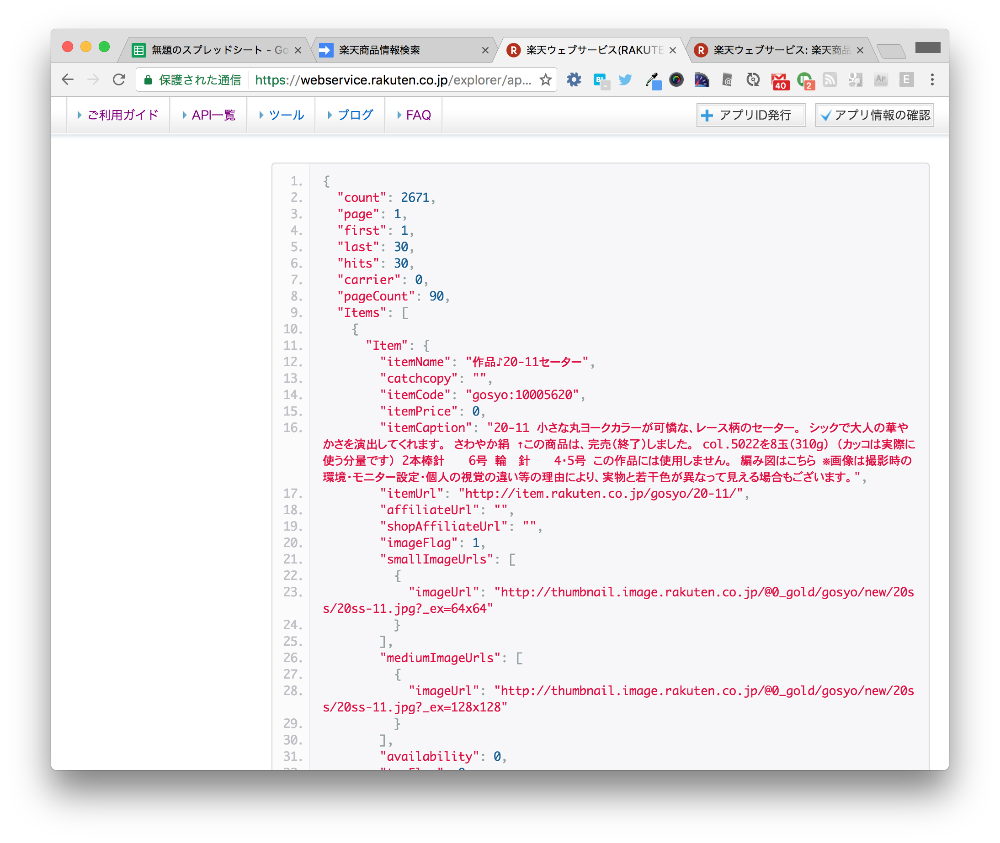
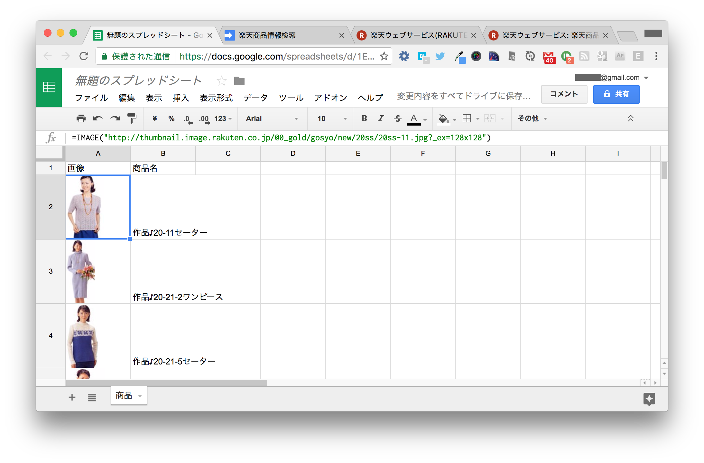
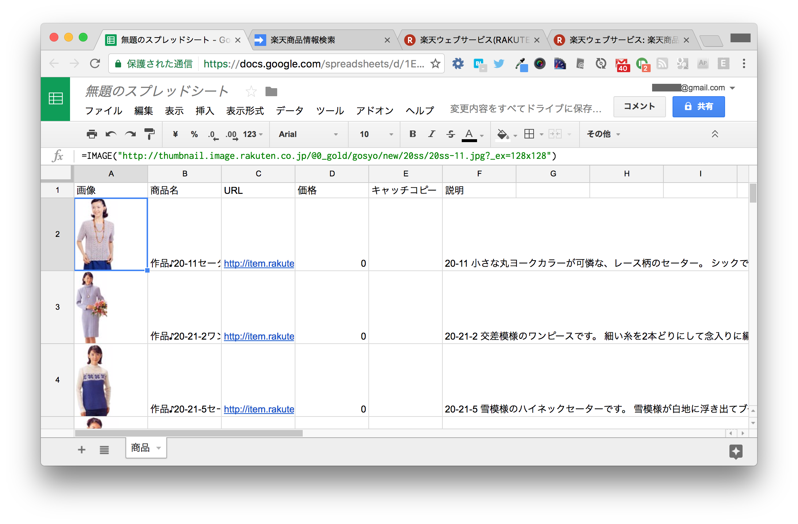

.. highlight:: javascript
   :linenothreshold: 5

===================================
ハンズオン2. 楽天の商品情報取得
===================================

このハンズオンでは、Google Apps Scriptを使って楽天商品検索APIを呼び出し、楽天の商品情報を収集します。

完成イメージ
============

完成イメージは以下のとおりです。楽天の商品の名前や画像、URL、価格などが一覧表になっています。

楽天商品検索API
===============

`楽天ウェブサービス: 楽天商品検索API(version:2014-02-22) | API一覧 <https://webservice.rakuten.co.jp/api/ichibaitemsearch/>`_

楽天では商品情報を検索するためのAPI（Application Programming Interface）を公開しています。
APIとは、あるプログラムから別のプログラムの機能を呼び出すための方法です。
ここではGoogle Apps Scriptから楽天の機能を呼び出します。

APIを使うとWebページからデータを抜き出すより簡単にデータを収集できます。
楽天のAPIを使うには、楽天アカウントでアプリIDを発行する必要があります。

1. Google Apps Scriptを使ってみる
=================================

1-1. 関数を作成する
--------------------

新しいスプレッドシートを作成し、シート名を「シート1」から「商品」に変更しておきます。

メニューの「ツール」→「スクリプトエディタ」をクリックするとスクリプトエディタが開きます。
ここにGoogle Apps Scriptを記入していきます。

デフォルトで ``myFunction`` という名前の関数が書かれています。
``{`` と ``}`` で囲まれた部分が関数の本体で、この部分に処理を書きます。

まず、以下のように書いてみましょう。
各行の ``//`` 以降はわかりやすくするためのコメントなので書かなくて構いません。 ::

    function myFunction() {
      var ss = SpreadsheetApp.getActiveSpreadsheet();  // 現在のスプレッドシートを取得する
      var sheet = ss.getSheetByName("商品");  // 商品シートを取得する（商品シートが無いと次の行でエラーになる）
      sheet.getRange(1, 1).setValue("画像");  // A1セル（1行目の1列目）に「画像」と入力する
      sheet.getRange(1, 2).setValue("商品名");  // B1セル（1行目の2列目）に「商品名」と入力する
    }

1-2. 関数の実行
--------------------

書けたら、ツールバーの▶ボタン（実行ボタン）をクリックして実行してみましょう。
実行ボタンをクリックすると、その右の箇所で選択された関数（ここではmyFunctionのみ）が実行されます。

「プロジェクトを実行するには、先に保存する必要があります。今すぐ保存しますか？」と表示されたら、「はい」を選択し、「楽天商品情報検索」など適当なプロジェクト名を入力します。
この場合、もう一度実行ボタンをクリックします。

「承認が必要です」と表示されたら、「許可を確認」をクリックします。
Googleアカウントの画面が表示されるので、「許可」を選択します。

実行に成功した場合はなにも表示されません。
スプレッドシートに戻ってみると、A1セルとB1セルに文字列が入力されています。

このようにGoogle Apps Scriptを使うと、プログラムで自動的に値を入力できます。

2. 楽天商品検索APIを使ってみる
=================================

2-1. APIテストフォームで検索してみる
------------------------------------

APIでどんな値を取得できるか知るには、APIテストフォームが便利です。

`楽天ウェブサービス(RAKUTEN WEBSERVICE) : APIテストフォーム <https://webservice.rakuten.co.jp/explorer/api/IchibaItem/Search/>`_

デフォルトでパラメータが入力されているので、そのままGETボタンをクリックすると、検索結果が表示されます。

このハンズオンでは、 `毛糸ピエロ <http://www.rakuten.co.jp/gosyo/>`_ という毛糸ショップで公開されている無料の編み図を検索します。
興味が無い場合は他の商品を検索しても構いません。

以下のようにパラメーター入力してGETをクリックします。
後ろの2つのパラメーターは「パラメーターを選択してください」から選択すると入力できます。

* ``keyword`` = （空）
* ``genreId`` = （空）
* ``itemCode`` = （空）
* ``shopCode`` = ``gosyo`` （ショップのURLの ``item.rakuten.co.jp/`` の後の部分の文字列）
* ``availability`` = ``0`` （0にすると販売されていない商品を検索に含める）
* ``pamphletFlag`` = ``1`` （1にすると資料請求対象製品のみを検索する）
* ``sort`` = ``+updateTimestamp`` （更新日時の古い順に並べる。これを指定しないと検索の度に異なる順序になってしまう）

結果は以下のようになります。

結果の2行目にある ``"count": 2671`` から、全部で2,671件の検索結果があることがわかります。
ただし、一度に全件のデータを取得できるわけではなく、1ページあたり30件のみを取得できます。
8行目の ``"pageCount": 90`` から、全部で90ページあることがわかります。

実際の検索結果は、 ``Items`` という項目の中にあります。

商品検索APIの詳しい使い方は以下のページを参照してください。

`楽天ウェブサービス: 楽天商品検索API(version:2014-02-22) | API一覧 <https://webservice.rakuten.co.jp/api/ichibaitemsearch/>`_

2-2. アプリIDの発行
-------------------

テストフォーム以外で楽天商品検索APIを使うには、アプリIDを発行する必要があります。

1. 以下のページにアクセスします。

   https://webservice.rakuten.co.jp/app/create

2. ログイン画面が表示された場合は楽天アカウントでログインします。

3. 利用規約を読み、フォームの項目を埋めて「規約に同意して新規アプリを作成」ボタンをクリックします。

4. 表示されたアプリIDを控えておきます。SecretやアフィリエイトIDは使用しません。

APIテストフォームに自分のアプリIDを入力し、先ほどと同様に検索できることを確認します。

2-3. Google Apps ScriptからAPIを呼び出す
----------------------------------------

スクリプトエディタで以下のように7行目以降を追記します。
``var url = ...`` という行には、APIテストフォームのGETボタンの上に表示されたURLを書きます。 ::

    function myFunction() {
      var ss = SpreadsheetApp.getActiveSpreadsheet();  // 現在のスプレッドシートを取得する
      var sheet = ss.getSheetByName("商品");  // 商品シートを取得する（商品シートが無いと次の行でエラーになる）
      sheet.getRange(1, 1).setValue("画像");  // A1セル（1行目の1列目）に「画像」と入力する
      sheet.getRange(1, 2).setValue("商品名");  // B1セル（1行目の2列目）に「商品名」と入力する

      // APIテストフォームで表示されたURL（applicationId=以降は自分のアプリIDに置き換えてください）
      var url = "https://app.rakuten.co.jp/services/api/IchibaItem/Search/20140222?format=json&shopCode=gosyo&availability=0&pamphletFlag=1&sort=%2BupdateTimestamp&applicationId=1011409349621322724";
      var response = UrlFetchApp.fetch(url);  // 指定したURLのページを取得する
      var json = JSON.parse(response.getContentText());  // JSON形式の文字列をプログラムから扱えるようパースする

      // すべての商品について反復処理する
      json.Items.forEach(function(item, i) {
        // 個別の商品の処理を書く。iは0から29まで。
        var row = 2 + i;  // 行番号
        sheet.setRowHeight(row, 100);  // 行の高さを100pxにする
        sheet.getRange(row, 1).setValue('=IMAGE("' + item.Item.mediumImageUrls[0].imageUrl + '")');  // A列に画像を表示する
        sheet.getRange(row, 2).setValue(item.Item.itemName);  // B列に商品名を入力する
      });
    }

実行ボタンで実行します。
「承認が必要です」と表示されたら、先程と同様に「許可を確認」「許可」を選択します。

実行が完了すると、スプレッドシートに最大30件の商品の画像と商品名が表示されます。

このスクリプトで重要なのがGoogle Apps Scriptの ``UrlFetchApp.fetch()`` 関数です。
この関数は引数で指定したURLのページを取得します。

* `Class UrlFetchApp  |  Apps Script  |  Google Developers <https://developers.google.com/apps-script/reference/url-fetch/url-fetch-app>`_

また、GoogleスプレッドシートのIMAGE()関数を使うと、引数で指定したURLの画像をセルに表示できます

* `IMAGE - ドキュメント エディタ ヘルプ <https://support.google.com/docs/answer/3093333?hl=ja>`_

3. より多くの情報を取得する
=================================

30件だけでは物足りないので、全件を取得してみましょう。

3-1. 取得項目を増やす
---------------------

せっかくなので、画像と商品名以外にも取得する項目を増やします。
以下のように6〜9行目と23〜26行目を追記します。 ::

    function myFunction() {
      var ss = SpreadsheetApp.getActiveSpreadsheet();  // 現在のスプレッドシートを取得する
      var sheet = ss.getSheetByName("商品");  // 商品シートを取得する（商品シートが無いと次の行でエラーになる）
      sheet.getRange(1, 1).setValue("画像");  // A1セル（1行目の1列目）に「画像」と入力する
      sheet.getRange(1, 2).setValue("商品名");  // B1セル（1行目の2列目）に「商品名」と入力する
      sheet.getRange(1, 3).setValue("URL");  // C1セル以降にも入力する
      sheet.getRange(1, 4).setValue("価格");
      sheet.getRange(1, 5).setValue("キャッチコピー");
      sheet.getRange(1, 6).setValue("説明");
      
      // APIテストフォームで表示されたURL（applicationId=以降は自分のアプリIDに置き換えてください）
      var url = "https://app.rakuten.co.jp/services/api/IchibaItem/Search/20140222?format=json&shopCode=gosyo&availability=0&pamphletFlag=1&sort=%2BupdateTimestamp&applicationId=1011409349621322724";
      var response = UrlFetchApp.fetch(url);  // 指定したURLのページを取得する
      var json = JSON.parse(response.getContentText());  // JSON形式の文字列をプログラムから扱えるようパースする
      
      // すべての商品について反復処理する
      json.Items.forEach(function(item, i) {
        // 個別の商品の処理を書く。iは0から29まで。
        var row = 2 + i;  // 行番号
        sheet.setRowHeight(row, 100);  // 行の高さを100pxにする
        sheet.getRange(row, 1).setValue('=IMAGE("' + item.Item.mediumImageUrls[0].imageUrl + '")');  // A列に画像を表示する
        sheet.getRange(row, 2).setValue(item.Item.itemName);  // B列に商品名を入力する
        sheet.getRange(row, 3).setValue(item.Item.itemUrl);   // C列: URL
        sheet.getRange(row, 4).setValue(item.Item.itemPrice);  // D列: 価格
        sheet.getRange(row, 5).setValue(item.Item.catchcopy);  // E列: キャッチコピー
        sheet.getRange(row, 6).setValue(item.Item.itemCaption);  // F列: 説明
      });
    }

実行すると、より多くの項目を得られます。

3-2. 全件を取得する
-------------------

全件を取得するには、ページ番号を1, 2, 3...と変えて何回も取得する必要があります。
以下のように書き換えると、最後のページまでたどって商品を取得できます。  ::

    function myFunction() {
      var ss = SpreadsheetApp.getActiveSpreadsheet();  // 現在のスプレッドシートを取得する
      var sheet = ss.getSheetByName("商品");  // 商品シートを取得する（商品シートが無いと次の行でエラーになる）
      sheet.getRange(1, 1).setValue("画像");  // A1セル（1行目の1列目）に「画像」と入力する
      sheet.getRange(1, 2).setValue("商品名");  // B1セル（1行目の2列目）に「商品名」と入力する
      sheet.getRange(1, 3).setValue("URL");  // C1セル以降にも入力する
      sheet.getRange(1, 4).setValue("価格");
      sheet.getRange(1, 5).setValue("キャッチコピー");
      sheet.getRange(1, 6).setValue("説明");
      
      // シートの行数が3001行より少ない場合は、途中で足りなくなるので行を追加する
      if (sheet.getLastRow() < 3001) {
        sheet.insertRowsAfter(sheet.getLastRow(), 3001 - sheet.getLastRow());
      }
      
      // APIテストフォームで表示されたURL（applicationId=以降は自分のアプリIDに置き換えてください）
      var startUrl = "https://app.rakuten.co.jp/services/api/IchibaItem/Search/20140222?format=json&shopCode=gosyo&availability=0&pamphletFlag=1&sort=%2BupdateTimestamp&applicationId=1011409349621322724";
      var page = 1;  // 現在のページ番号
      
      // ページがあるかぎり繰り返す
      while (true) {
        var url = startUrl + "&page=" + page;  // startUrlにページ番号をつけて、現在のページのURLを生成する
        var response = UrlFetchApp.fetch(url);  // 指定したURLのページを取得する
        var json = JSON.parse(response.getContentText());  // JSON形式の文字列をプログラムから扱えるようパースする
        
        // すべての商品について反復処理する
        json.Items.forEach(function(item, i) {
          // 個別の商品の処理を書く。iは0から29まで。
          var row = 1 + json.first + i;  // 行番号（firstに現在のページの開始番号が含まれている）
          sheet.setRowHeight(row, 100);  // 行の高さを100pxにする
          
          // 画像のURLが含まれていない商品がたまにあってエラーになるが無視する
          try {
            sheet.getRange(row, 1).setValue('=IMAGE("' + item.Item.mediumImageUrls[0].imageUrl + '")');  // A列に画像を表示する
          } catch (e) {
            // エラーが起きてもなにもしない
          }
          sheet.getRange(row, 2).setValue(item.Item.itemName);  // B列に商品名を入力する
          sheet.getRange(row, 3).setValue(item.Item.itemUrl);   // C列: URL
          sheet.getRange(row, 4).setValue(item.Item.itemPrice);  // D列: 価格
          sheet.getRange(row, 5).setValue(item.Item.catchcopy);  // E列: キャッチコピー
          sheet.getRange(row, 6).setValue(item.Item.itemCaption);  // F列: 説明
        });
        
        // 最後のページまで到達したら繰り返しを抜ける（最大100ページ）
        if (json.page >= json.pageCount) {
          break;
        }
        page = page + 1;  // ページ番号を1増やす
        Utilities.sleep(1000);  // 1秒待つ（サーバーに負荷をかけないように）
      }
    }

実行するとしばらく「関数 myFunction を実行中...」と表示されますが、終わるまで待ちます。
およそ2分ほどかかります。

4. まとめ
=========

このハンズオンは以上です。

このハンズオンでは、Google Apps Scriptから楽天商品検索APIを呼び出して、楽天の商品情報を収集しました。
Google Apps Scriptを使って、スクリプトからGoogleスプレッドシートを操作しました。
また、 ``UrlFetchApp.fetch()`` 関数を使ってページを取得できました。

APIを使うことで、普通のWebページからデータを収集するよりも簡単かつ確実にデータを収集できました。
Google Apps Scriptを使うことで、IMPORTHTML関数では難しい複数のページからのデータ取得もできました。
